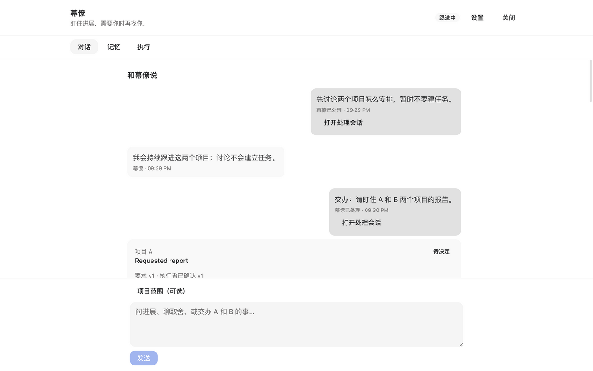
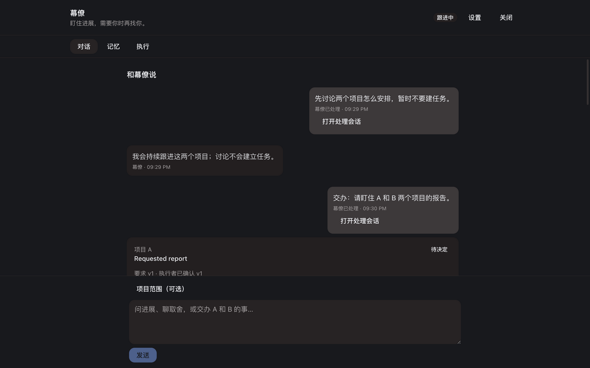
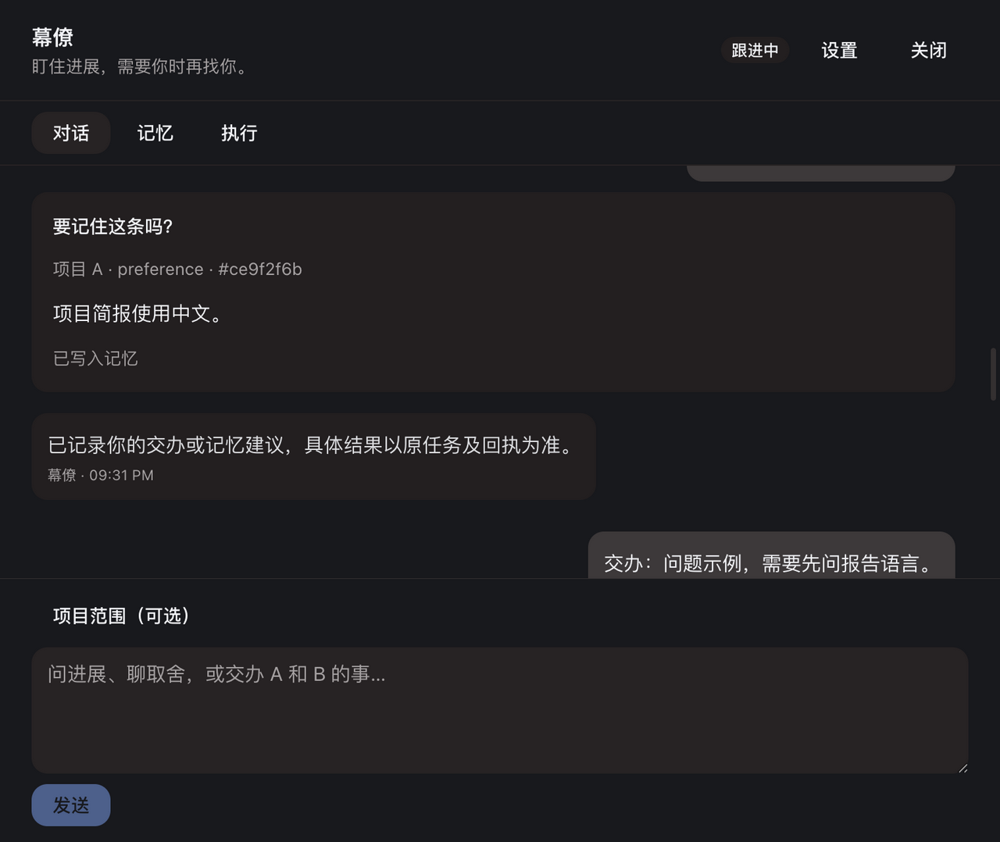
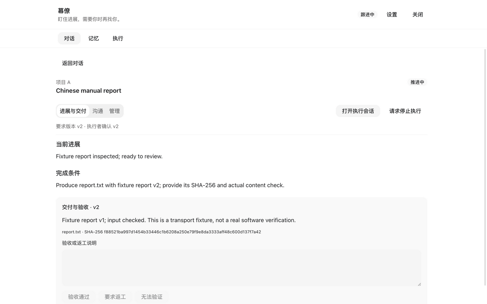
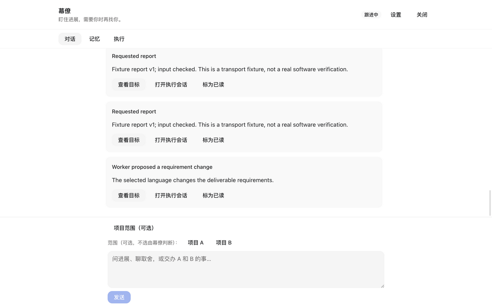

# Verification: Assistant Agent First

## Verification

- AC-1: PASS — 真实 Runtime 离线 ACP 和 React Web/Core：讨论有持久关联回复且不建目标；同一隔离数据目录重启后消息、回复与回执仍可读。见 [Core](evidence/owner-core-tests.log)、[界面操作](evidence/render.json)。
- AC-2: PASS — 一句话 A/B 交办生成两个带 turn_id 的项目 Request，各建目标并派发一次，重复 tick 不重派。范围与已有执行控制检查通过。见 [独立协调](evidence/independent-r6-assistant.log)、[实际状态](evidence/render-state.json)。
- AC-3: PASS — 补充、停止/优先级、问题答复和改方向复用原控制与要求版本。stop + priority 同批原子提交；纯“好的”不触发 cancel/change/route，权限仍在原会话处理。同目标 Message + Change 同批原子拒绝，用户原文保留，模型须将补充合入新要求。实际 UI 已操作问题回答、采用变更、执行者确认 v2、交付与人工验收。见 [独立协调](evidence/independent-r6-assistant.log)、[桌面](evidence/owner-desktop-tests.log)、[实际产物](evidence/render-artifacts.json)。
- AC-4: PASS — 原慢 Provider/session/new/steering、及时停止、独立审查、相关版本及额度释放回归，加新 intake lane/慢分析接收回归通过。无关 B 不撤销 A，同事项版本/控制代次/较新用户决定使旧动作失效。见 [独立 Core](evidence/independent-r6-core.log)，不以旧异步 Verification 代替新验收。
- AC-5: PASS — 源消息、准确内容/hash、项目范围、确认/遗忘/回忆及已知失败和未知结果检查通过。手动记忆只精确去重，L1/profile 同事务故障回滚；卡片区分 confirmed 待写入和持久 memory_id。见 [独立 Core](evidence/independent-r6-core.log)、[桌面状态测试](evidence/owner-desktop-tests.log)、[实际记忆](evidence/render.json)。
- AC-6: PASS — 接收/领取/创建/发送/回执恢复通过；同 id 同参幂等、异参拒绝；未知结果不自动重放；停止回执前不替换写入者；旧快照默认字段可读。见 [独立 Core](evidence/independent-r6-core.log)、[独立投递](evidence/independent-r6-prompt-delivery.log)。
- AC-7: PASS — 最终实际 React Web + 生产 Core 浅/深色 1280×800、深色窄窗 760×640 已渲染，无原生 details/summary，无横向溢出，输入框在滚动区外且可达。问题、变更、交付详情与验收实际可操作；草稿恢复通过桌面测试。每事项默认最新进展，较早通知按需展开且不更改 read 事实。见 [渲染范围](evidence/render.json)。
- AC-8: PASS — owner 完整 Core、受影响桌面与适用 build/check 通过；Cursor r6 独立重算源码及测试可执行文件身份，并实际复跑 Core lib/协调/投递和查看三张渲染图。见 [独立报告](evidence/independent-review-r6.json)、[独立日志汇总](evidence/independent-r6-checks.json)。owner 结果保留其归属。

Verdict: verified.
Residual risk: 真实付费模型业务实战、原生打包桌面通知、远程 CI、邮件/飞书外部集成未验证。没有 PR、发布或部署。非平凡自然语言仍由模型解释，Core 校验范围、引用和相关版本，不宣称万能授权解析。原生 AwaitingInput 等人类在处理会话回答，占相应 intake 额度（并发 2）；不代批或超时重放，确定性控制、消息记账和独立 goal lane 保持可运行。

### 当前版本与实际检查

[源码身份](evidence/source-sha256.json) 记录 9 个已有文件变化和 4 个新增文件；owner 与 r6 分别重算开工前 1,671 文件，其余没有缺失或变化。原 Engine、App、MissionControl 等用户已有改动保留；Cargo manifests/lock 未改。隔离副本使用已有同版本 Ghostty pkg-config，唯一附加 Runtime 内容为 [原始资源释放探针](evidence/original-resource-release-probe.rs)。见 [构建环境](evidence/build-environment.json)、[可执行文件身份](evidence/test-executables.json)。

| 检查 | 来源及结果 |
| --- | --- |
| 完整 Core crate | [owner](evidence/owner-checks.json)：751 passed、1 个既有 ignored；lib 584 = 583 生产 + 1 原探针，协调 27、投递 6，含全部其他集成与 doc 检查 |
| Core lib、协调、投递 | [Cursor r6 独立运行](evidence/independent-r6-checks.json)：584 / 27 / 6 passed；生产 Runtime 28 + 1 原探针在 lib 内 |
| 桌面 6 个受影响测试文件 | [owner](evidence/owner-desktop-tests.log)：76 passed、0 failed |
| lint、types、Web、renderer、server | owner 通过：[lint](evidence/owner-desktop-lint.log)、[types](evidence/owner-desktop-types.log)、[Web](evidence/owner-web-build.log)、[renderer](evidence/owner-renderer-build.log)、[server](evidence/owner-server-build.log) |
| scoped rustfmt、docs、SDLC、diff | [收尾检查](evidence/handoff-checks.json)，纯功能改动未改变生命周期规则/检查器，无需 lifecycle Eval |

r6 首次命令沙箱阻止 Git hook 临时目录与 PTY，Core 109 个失败；协调与投递通过。通过原 approval-required 运行时的本地执行权限重跑同一已准备可执行文件后全通过，未更改持久权限、模型或依赖。首轮日志仍在 [独立检查记录](evidence/independent-r6-checks.json)，不是产品缺陷。Vite 大 chunk 与测试 setup 变量警告保留。

### 真实渲染与产物

图片来自实际应用，业务模型由 [离线 ACP](evidence/offline-acp.py) 代替。Question 图片在本轮较早阶段拍摄，随后 Question/Change 组件未改；其余是最终 Web build，来源在 render.json 区分。r6 实际查看了浅色沟通、深色窄窗记忆、交付详情三张，未声称独立操作浏览器或看其余两张。

A 的旧已验收文件被后续 v2 覆盖后正确回到 NeedsAttention；B 仍已验收。v2 文件实际内容是 fixture report v2，哈希逐字节核对后经 UI 人工验收。夹具提交的描述字符串固定提到 v1，不等于文件正文，不能用于业务语义验收；[产物证据](evidence/render-artifacts.json) 及人工验收记录区分了两者。

### 审查与修补

[规划审查](evidence/planning-review.json) 是设计输入；人类批准来自原会话明确答复，姓名和模型建议不代替批准。[r5 报告](evidence/independent-review-r5.json) 的记忆提前称已保存、相似合并两项中等问题已修并加回归；并发 UI 编辑的触发假设被生产共用短 gate 反证。含糊确认及同批补充/变更已加防护。[r6](evidence/independent-review-r6.json) 终态 completed、无待运行子任务，结论 PASS，未找到中/高阻塞；保留其具体检查范围及低风险观察。

初次 UI 夹具将项目放在父 Git 仓库内部，创建结果未知且未重放。之后用新的可丢弃数据库和独立 /tmp 项目纠正测试环境，见 [初始环境记录](evidence/initial-fixture-correction.json)。

## Cleanup

Removed: 3,948,098,958 字节本任务 scratch（专用 Cargo 输出、同源副本、Web/renderer 输出、离线数据库/ACP、worker/review 临时目录和冗余日志），独立 /tmp 项目、tab_6 和已转存的 14 张本任务原截图。
Retained: 本目录正式紧凑证据；另保留 [188,247 字节回滚包](evidence/before-source.zip)，保存本轮前未提交文件的准确字节，非编译输出。
Retention owner: codex，负责此本地变更。
Cleanup trigger: 用户接受变更或明确完成回滚后删除回滚包；本次交付保留原字节供审阅/恢复。
Processes: 本任务 Core 经 SIGINT 正常退出；ps 与 lsof 复核无所属进程、14675 无监听，两个 UI 数据库无 worktree_path，未删除无归属的已有 Git worktree。所有子任务已终态且无 pending；Core r2 超预算后对原任务取消一次并确认 interrupted，不冒称 completed。后续 r3、UI r2、测试 r4、复核 r5/r6 均 completed。
Evidence: [资源清点与清理](evidence/cleanup.json)、[任务身份/模型/终态](evidence/delegation.json)、[收尾检查](evidence/handoff-checks.json)。未停止用户进程，未删除共享缓存或用户数据。

## Review and release

Approval: 用户在原会话明确确认具体设计并要求继续并行开发；仅授权本地工作。
Rollback: See plan.md and retained exact pre-round bytes; 不使用工作树级 reset，不擦除用户对话或记忆。
Release: No PR, push, merge, publication or deployment.
Feedback: r5 缺陷及 r6 结果保留；后续实战或外部集成须单独验收。
