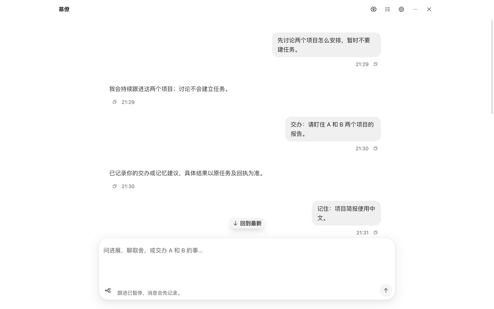
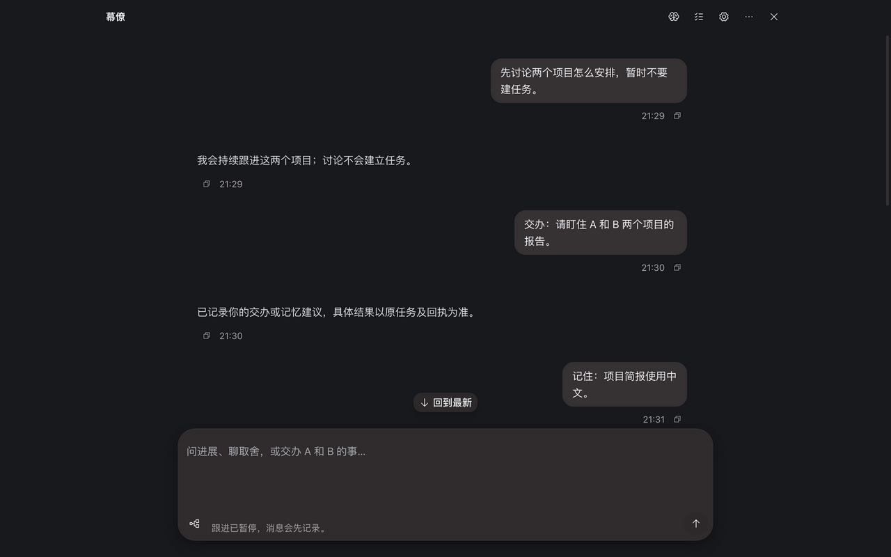
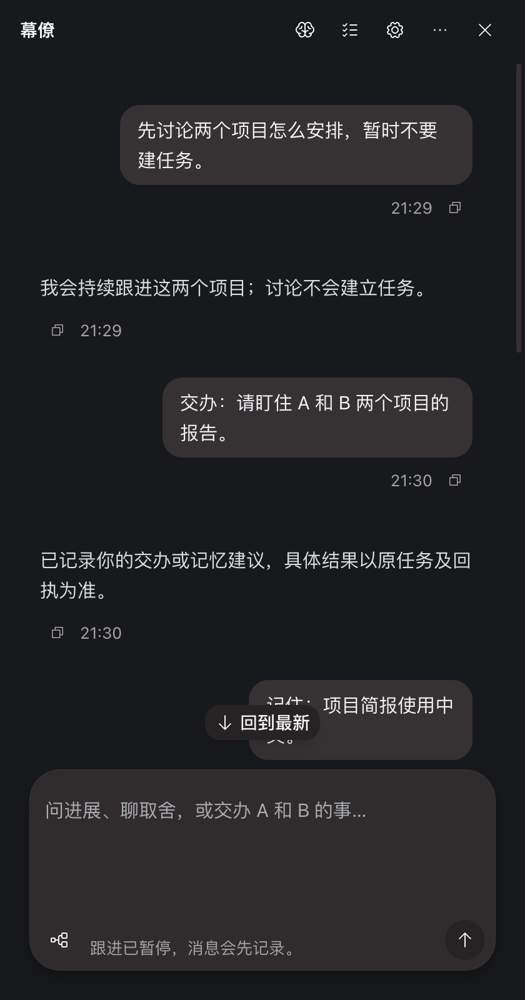
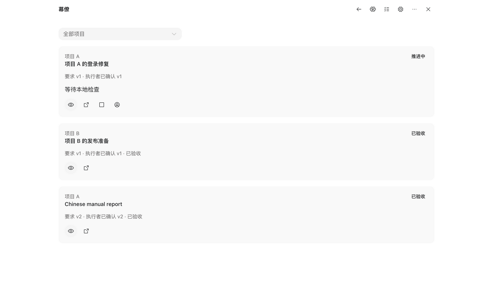
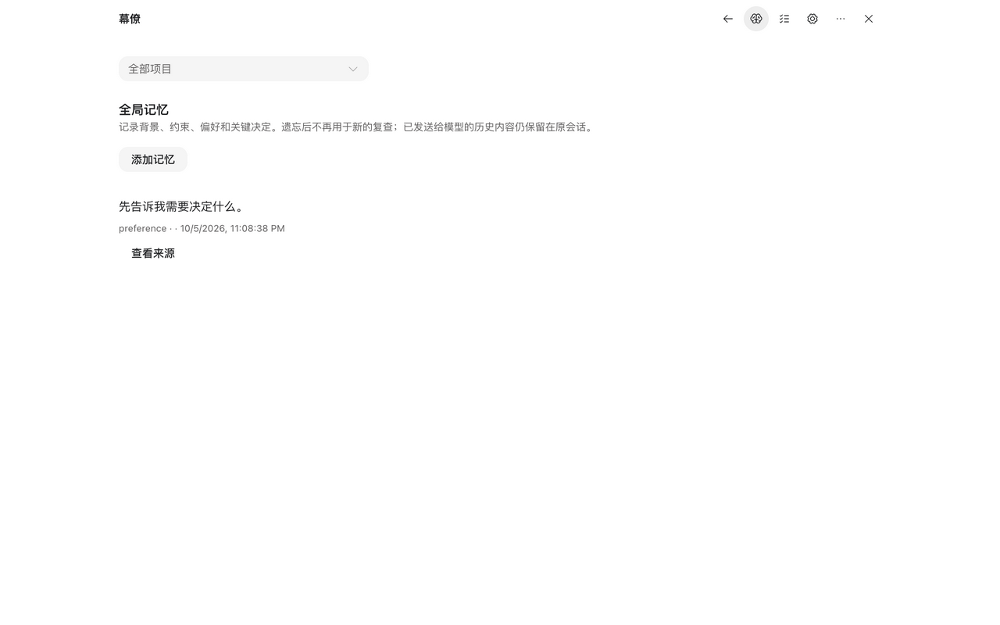
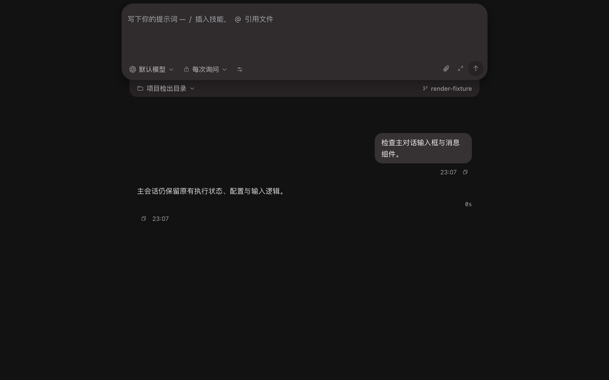
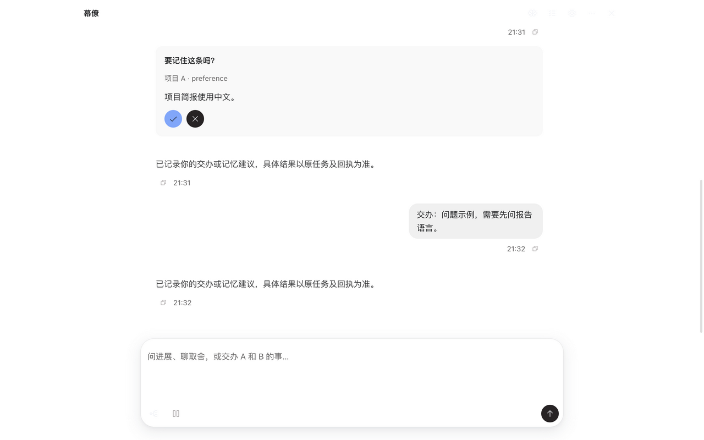
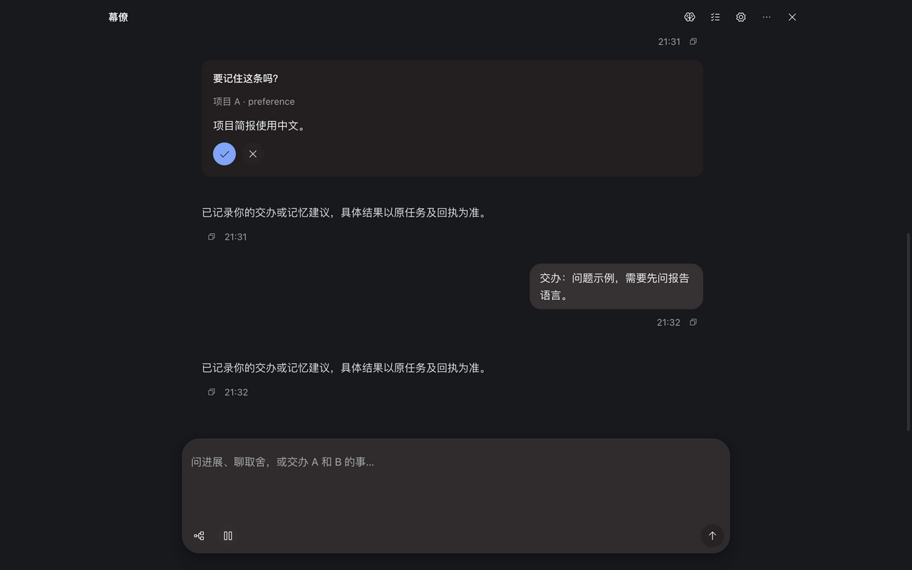
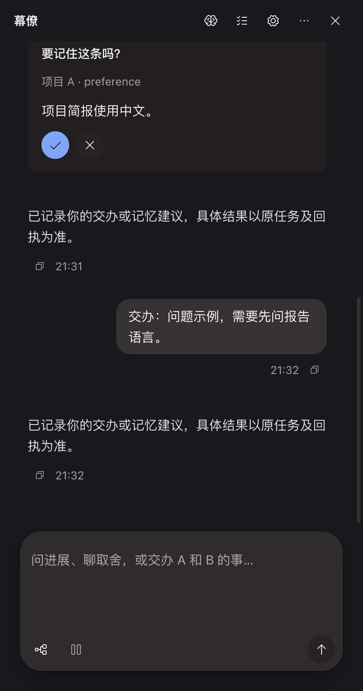

# Verification: Assistant Shared Conversation

## Verification

- AC-1: PASS — 主 Composer 与 ChiefThread 实际共同使用 ComposerCard、ComposerSendButton、DocEditor；主 App 和幕僚共用 TranscriptPane、TurnCard、useTranscriptScroll。删除幕僚原 textarea、气泡及滚动实现。最终主会话相关 53 项、滚动 3 项、Editor 8 项通过；实际主 Composer 紧凑/展开/收起与幕僚渲染见 [检查记录](evidence/checks.json) 和 [实际交互](evidence/render-checks.json)。主 App 业务路由未变。
- AC-2: PASS — 默认仅对话及共享输入框；记忆、持续任务、设置用图标打开，诊断位于更多工具。常规跟进目标和处理/执行会话入口隐藏；开发者检查可进入原详情。原 1280px 浅/深色、420px 窄窗及任务检查见 [真实渲染与入口检查](evidence/render-checks.json)。2026-10-06 暂停文案改为只读 Pause 图标；真实浅色、深色窄窗无常驻文案或横向溢出，悬停和键盘聚焦显示原准确提示，未触发配置或控制写入。见 [本次实际渲染记录](evidence/followup-20261006.json)、[浅色](evidence/followup-20261006-paused-light.png)、[提示](evidence/followup-20261006-paused-tooltip.png)、[深色窄窗](evidence/followup-20261006-paused-narrow.png)。
- AC-3: PASS — 幕僚 41 项回归通过，包含原记录顺序、稳定失败重试 id、改稿新 id、发送中新草稿保护、Mod+Enter 不传至窗口、轮询和多页切换后草稿及阅读位置保留。失败提示不再被编辑器重复观察清掉；发送重入在导出等待前阻止。实际固定版本切换三页及一次 5.5 秒轮询均保留草稿/scrollTop=180，聚焦编辑器的 Mod+Enter 仅产生一次 say 且窗口事件增量为零。夹具回执仍为 recorded，未冒充执行采用。 见 [41 项回归日志](evidence/assistant-tests-confirmed.log) 和 [实际切换/发送记录](evidence/render-checks.json)。
- AC-4: PASS — 同一组回归保留原问题、权限原会话入口、记忆准确内容/范围及哈希绑定、版本冲突草稿、版本绑定验收、控制/接管及未知结果恢复入口。实际图标停止动作绑定原 control(stop)；记忆确认携带原 proposal_id/content_hash。执行控制仍由原 Core 管理；离线夹具的接受显示不证明真实投递或执行采用。图标保留可访问名称；主要工具和卡片操作复用 TooltipButton。 见 [保留契约回归](evidence/assistant-tests-confirmed.log) 和 [原接口动作记录](evidence/render-checks.json)。
- AC-5: PASS — 上轮 owner 共 105 项通过（幕僚 41 + 主会话 53 + 滚动 3 + Editor 8），见 [原检查记录](evidence/checks.json) 和 [原范围复核](evidence/scope-check.json)。2026-10-06 显示修补重新执行 29 项相关回归、desktop lint、tsc、Web/renderer 构建及实际渲染；docs、sdlc --worktree 和差异检查通过，见 [本次检查及范围记录](evidence/followup-20261006.json)。635 文件与本次前快照比较，仅 ChiefThread 变化，其他 634 文件（含 Core、主会话及测试）哈希未变；复用其有效旧证据，未将 105 项称为本次重跑。[最终源码哈希](evidence/source-sha256.json) 已更新并再读真实文件复核。清理见下节。

Verdict: verified

已授权的本地共享对话 UI 及 2026-10-06 暂停图标显示修补通过 owner 验收。未发布。

2026-10-06 follow-up: 用户明确选择 A，仅改显示。没有启用跟进，没有改变暂停时新消息只记录的处理行为，也未新增主动跟进协议或实战调用。
Residual risk: 本结论只覆盖已授权本地共享对话 UI。真实付费模型业务实战、原生打包桌面通知、远程 CI、邮件/飞书等外部集成仍未验证。此次没有启动 Core 或模型业务调用；未变化的异步/版本/未知结果协议复用 [此前 Core 验收](../2026-10-05-assistant-agent-first/verification.md)，未把此前 passed 当作本轮新跑结果。BlockNote Markdown 导出属于有损导出：本轮验证基本行内格式、嵌套列表与链接；不承诺完整保存所有引用/任务列表格式。不支持的嵌入树会拒绝发送并保留草稿。失败/不支持提示保守保留到下次发送。

### Check evidence

[幕僚 41 项](evidence/assistant-tests-confirmed.log)、[主会话 53 项](evidence/main-regression-final.log)、[滚动 3 项](evidence/transcript-scroll-final.log)、[Editor 8 项](evidence/editor-regression-final.log)、[lint](evidence/lint-final.log)、[types](evidence/types.log)、[Web build](evidence/web-build.log)、[renderer build](evidence/renderer-build.log)、[文档与生命周期检查](evidence/handoff-checks.log)。Bun 的主回归命令中曾误写一个 .tsx 筛选，未匹配实际 .ts 文件；该滚动文件已用明确路径单独执行 3 项通过，未计入未运行项。

实际渲染使用生产 React 组件、原 i18n/theme/style 和 T3 preview，API 为明确离线夹具，无 Engine/Provider。[夹具压缩包](evidence/render-fixture.zip) 可复现展示，不是 Core 或业务交付证据。以下原截图保留上轮范围；暂停状态的最终展示以本次截图为准。

### Follow-up 2026-10-06 evidence

[29 项相关回归](evidence/followup-20261006-tests.log)、[lint](evidence/followup-20261006-lint.log)、[types](evidence/followup-20261006-types.log)、[Web build](evidence/followup-20261006-web-build.log)、[renderer build](evidence/followup-20261006-renderer-build.log)、[收尾检查](evidence/followup-20261006-handoff.log)。构建日志保留紧凑尾部和原完整输出哈希；两种构建成功，仍有既有大分包提示。

[检查、渲染与清理记录](evidence/followup-20261006.json) 对应 [修补前源码哈希](evidence/followup-20261006-before-sha256.json) 与当前最终源码哈希。只读提示无 onClick，aria-disabled=true、tabIndex=0，键盘和鼠标提示均可达。离线夹具在 enabled=false/true 两种状态下分别显示/隐藏图标，动作记录为空；夹具状态修改不代表修改用户实例。

### Delegation and independent checks

工作目录均为 `/Users/chenli/.t3/worktrees/codeTwo/t3code-6738e658`。目标均为 Cursor `claude-sonnet-5-5`，明确 300K / high，approval-required，单轮监督预算 10 分钟。完整 taskId、childThreadId、开始时间和真实终态保存在下列原生回执；本记录不把 completed 等同于验收通过。

- r1：[委派](evidence/delegation-r1.json) / [终态](evidence/result-r1.json)。实施是部分成果，主 Agent 完成真实共用、消息顺序及修补。中途 T3 重启导致原 run 中断，平台产生后续继续 run；主 Agent 未向子会话发新轮任务，最终状态 completed、无待运行子 turn。不能据此宣称无人值守可靠。
- r2：[委派](evidence/delegation-r2.json) / [终态](evidence/result-r2.json)。只修改三个测试，38/40，指出失败提示与格式丢失。不是 PASS；两项源码问题由主 Agent 修补后重跑。
- r3：[委派](evidence/delegation-r3.json) / [终态](evidence/result-r3.json)。最终源码静态复核未发现 P1，主会话 53、Editor 8 独立通过；新增测试当时缺 Range 和过严空格断言，40/41 FAIL。主 Agent 修正测试环境与断言后 41/41 owner 通过，未改称独立通过。r3 源文件哈希与最终源码一致；额外 /tmp 测试副本已清理。未独立验收浏览器或 Core。

## Cleanup

Removed: 本轮 `.codex/run/assistant-shared-conversation/` 中 238,037,593 字节隔离构建、Vite cache、夹具及临时日志；r3 `/tmp/review_r3/range.test.ts` 副本及目录。正式交付 PNG 已逐字节 SHA256 核对；正式证据外的浏览器截图副本已按精确路径清理。
Retained: 本 bundle 的小型 evidence、截图、源码哈希、原生委派结果，以及 [窄范围回退包](evidence/before-source.zip) 和离线夹具包。保留本轮前所有源码/用户数据/其他工作的状态。
Retention owner: codex。
Cleanup trigger: 用户接受本轮或确认无需回退后可移除回退包和夹具包；其余正式证据随生命周期记录保留。
Processes: 仅停止已核对 PID/端口的本轮 Bun Vite 进程 84471，session 85216 正常退出；ps 无所属进程，14676 无监听。原生关闭本轮 tab_1。没有启动/停止用户 Core、Cursor、其他服务或持久自动化；三轮任务终态且 hasPendingChildRuns=false。
Evidence: [清理报告](evidence/cleanup.json)，真实 PID/端口检查、精确路径边界检查及清理后复查。文档和生命周期检查在清理后运行，不重建临时产物。

2026-10-06 follow-up cleanup: 精确清理本次 `.codex/run/assistant-paused-indicator-20261006/` 的 237,961,413 字节、4,226 个文件及已逐字节哈希核对的三个浏览器截图原件。仅停止已核对命令、cwd、PID/端口的本次 Bun Vite 55283，session 53638 正常退出；ps 无所属进程，14676 无监听。原生关闭本次 tab_3，没有启动或停止用户 Core/其他进程。保留本 bundle 的紧凑日志、截图及前后源码哈希，owner codex；正式证据随记录保留。见 [本次清理记录](evidence/followup-20261006.json)。

## Review and release

Approval: 本轮范围内本地实施已有用户授权；没有请求或执行 PR、push、merge、发布、部署或权限变更。
Rollback: 按 plan.md 的 before-source.zip 与 before-sha256.json 仅回退本轮差异，不全工作树 reset。
Release: 未发布；本地 verified 不表示远程 CI 或发布验收。
Feedback: 用户后续交互反馈沿此记录处理；保持既有幕僚 agent 和异步协议方向。
