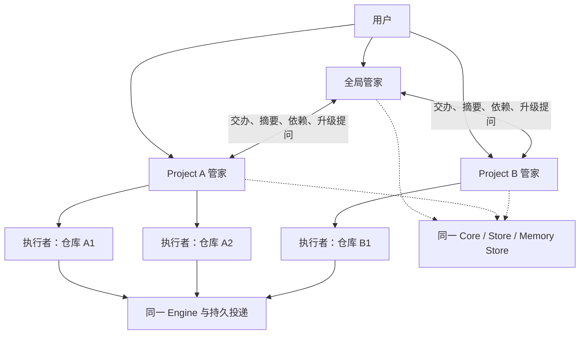

# Spec: 三级 Project agent 架构

## Design

**建议在现有协调器内加入逻辑身份和范围：全局管家 → Project 管家 → 执行者。** 两层管家使用相同基础设施、不同的职责、记忆和指令；目标/执行/回执仍由原 Core 与 Engine 管理。具体设计已获用户确认；本轮候选实现尚未验收，当前未有新运行功能生效。

### 1. 参考产品与实现基线

2026-10-06 核对官方资料：

- [Cursor Projects](https://cursor.com/docs/agent/projects)：协调 agent 做计划、委派和结果回收；长期上下文、并行执行、用户配置订阅；默认云运行。借鉴协调方式，不因此给本地 CodeTwo 增加关机运行、云资源或 Slack 权限。
- [Claude Projects](https://support.claude.com/en/articles/9519177-how-can-i-create-and-manage-projects)：项目知识和指令服务范围内对话。[Claude memory](https://support.claude.com/en/articles/11817273-use-claude-s-chat-search-and-memory-to-build-on-previous-context) 描述独立项目记忆与摘要。官方资料不证明 Claude Project 本身是自治派工管家。我们结合持续协调与范围内记忆/指令，不推测其内部架构。

当前源码：Store Project 的 path 是身份；AssistantGoal 的 project_path 是执行项目；AssistantState 有一份 settings/conversation 和逐事项 scoped_runs。Memory Store 已有路径范围、全局幕僚范围、读写策略、来源及注入回执，尚无业务 Project 或角色授权。源码版本见 [基线](evidence/preexisting-baseline.json)；调研真实结果见 [Core result](evidence/core-result.json)。

### 2. 三级职责

| 层级 | 负责 | 默认上下文 | 不能自行决定 |
| --- | --- | --- | --- |
| 全局管家 | 跨项目交办、优先级/依赖/资源统筹、进展摘要、向用户升级待决事项 | 全局偏好、项目状态投影、相关依赖、当前交办 | 改验收/权限/预算；绕过项目管家另开写入者 |
| Project 管家 | 范围内计划、拆分目标、派工、追问、结果和验收、向全局报告 | 本项目记忆/指令、目标、相关 workspace 知识、消息与回执 | 读兄弟项目私有记忆；代用户批准重要需求/权限；改跨项目承诺 |
| 执行者 | 一个明确 assignment 的实现、进展、提问、实际产物提交 | 目标、允许路径、工作区规则、必要记忆/依赖产物 | 自建项目任务树；改控制权；把一轮完成当验收 |

用户可对全局或项目直接说话。讨论不建任务；明确交办沿原授权推进；歧义问一个必要问题。明确“停 A / A 优先”由 host 复用现有控制及时记账，不等待两层模型商议。自动协调不扩大授权；具体需求/权限变化仍请用户决定。

### 3. Project 与 workspace 身份

新增 ManagedProject（业务 Project），用稳定 UUID、名称、状态、版本。现有 Store::Project 保留路径身份和会话默认值，成为关联 workspace；不用它记录第二份项目进度。

- 一个业务 Project 可绑定多个已登记目录；绑定有规范化路径、版本、用户来源；执行仍使用真实 cwd/worktree。
- 同一目录可服务多个业务 Project，但每个目标必须明确业务 Project 与执行 workspace。多个候选时询问，不能按最近项目猜测。
- 改名不改 UUID；目录搬迁需显式重绑；撤销/失效绑定不再提供新读取/派工权限。
- 管家身份稳定为 chief 和 project:<UUID>。Provider session_id 只是运行资源；host 绑定调用身份，模型自报 actor/Project/cwd 不能授予权限。
- 跨仓库工作拆成现有 AssistantGoal，单目标只有一个所属业务 Project 和一个执行 workspace，沿现有 dependencies 串联。整个业务 Project 的所有目录不自动成为单任务可写范围。
- Git 写任务复用隔离 worktree。共享非 Git workspace 不能证明隔离的写任务只允许一个领取者，按资源控制资格；不能把全局并发额度当文件隔离。

### 4. 最小持久扩展与唯一事实源

以下是待实施字段，最终 type 与兼容 guard 必须有迁移测试。最小方案把 ManagedProject、绑定及全局/项目 instruction 文档放在现有 AssistantState 的扩展字段内，用原 revision CAS 一次保存；不新增身份表与同步器。Memory 继续用同库已有表，范围解析只读这个权威映射。

| 所有者 | 扩展 | 不变量 |
| --- | --- | --- |
| 同一 Store 数据库 | ManagedProject、workspace bindings、版本化 instruction 文档 | 身份/绑定/指令各一份；无第二 DB 或自动 Markdown 写入者 |
| AssistantState | 管家身份/策略；请求的项目路由；目标 managed_project_id/owner_epoch；对话 actor_id | 目标/问题/变更/验收还是原记录，Project 摘要只是投影 |
| scoped_runs/attempts | 角色范围、输入版本凭据、持久尝试关联 | 一事项一个有效审查，一目标一个控制者，领取先于网络 |
| Memory Store | 类型化范围解析、读取组合与来源边 | 保留原 memory id/策略/回执；组合不复制事实 |
| Engine/prompt_delivery | 复用创建、执行、steering、停止和回执 | 唯一执行投递；unknown 不再创建第二写入者 |

跨项目父交办复用 UserRequest，新增业务 Project 路由/父引用。按 parent_request_id + managed_project_id + route_revision 幂等生成子请求。Project 管家从子请求建立原目标；全局引用这些目标，不复制另一套“全局任务”。

管家的短上下文可重建：当前持久事实、相关对话、带来源的记忆。换会话/压缩不改变身份，不把长模型窗口作为长期记忆保证。

绑定/指令/goal owner 更新走同一 AssistantEdit CAS。记忆确认/共享沿现有持久 proposal + 一次写回执，不能跨文档复制写两次。业务 Project 改需求与跨项目交付不直接搬 assignment；用原目标版本/依赖或用户确认的显式交接。

### 5. 记忆：各自范围，共用一库

| 读取者 | 默认可读 | 按需且校验策略 | 默认不可读 |
| --- | --- | --- | --- |
| 全局管家 | 全局用户偏好、项目状态投影、显式跨项目承诺 | 当前交办所涉 Project 的相关记忆/证据、用户要求的细节 | 所有 Project 全量对话、原始外部输入 |
| A 管家 | A 确认记忆/决策/工作片段，可继承的全局偏好 | 绑定 workspace 技术知识、相关且授权的依赖产物 | B 私有记忆/对话、未共享全局私人记忆 |
| A 执行者 | 本目标与必要 A/workspace 片段 | 授权依赖产物 | 全局私人资料、其他项目历史、不相关记忆 |

保留 L0–L3、词法检索，不加 embedding、外部记忆服务或隐藏付费整理。业务范围用稳定键，如 codetwo://managed-project/<UUID>；原路径记忆仍属于 workspace，不复制/批量迁走。共用目录的技术知识不自动成为各项目的私有决策。

全局偏好下传先展示准确文本及“仅全局 / 项目管家 / 执行者”范围后确认；历史全局笔记不自动扩大给全部执行者。项目记忆提升为全局、跨项目分享或转成指令，都需准确内容与目标范围确认。

召回同时满足全局、业务 Project、原 workspace、会话策略，相关 deny 优先。保留实际注入的 memory id、内容版本/哈希、来源和范围。修改/纠正使相关审查失效，无关 B 更新不废弃 A 决定。摘要存源引用/版本，不成为另一份事实。遗忘撤销派生引用和后续召回；已发送 Provider 文本不能撤回，影响在途工作须显式纠正/停止。

自动学习只产生带 provenance 的知识/片段，不把推断写成用户事实，不把第三方反馈升为指令或授权。手动记忆仍是资料。

### 6. 指令：与记忆分开，版本与采用可检查

全局/每个 Project 各有 instruction 文档：scope、revision、正文、来源、确认回执、哈希。模型只能建议修改，用户确认后启用。保存、发送、接受、采用是不同状态。

组合规则：

1. 平台/host 权限和角色边界，以及执行目录仓库约束，不能被下层文档放宽。
2. 已确认全局管家指令/可继承偏好。
3. 本 Project 的确认目标、约束、具体偏好。
4. 当前交办的明确内容及版本化验收。

同级偏好在具体范围使用具体者：全局简短中文内部汇报，B 对客户交付英文产物可以兼容。与已确认硬约束/权限冲突时，给用户具体冲突；不能靠新旧时间或较近层级扩大授权。执行者得到的是授权任务，不是管家创造的新规则。

复用 Engine rules/编译/Provider 传输；保留仓库规则、Scene、用户文档顺序和 Codex 原生 AGENTS.md 去重。新文档在明确 host instruction 槽位只编译一次，不重写仓库文件；不能把多个工作区的规则全部拼接覆盖。

审查绑定实际 instruction revision/hash；更新使相关未提交决定失效。在途工作复用发送/接受/采用证据；不支持 steering 时说明“已记录，下一轮采用”。立刻改工作需沿停止/重新确认路径，不显示虚假“已采用”。

### 7. 管家通信与异步控制

两层通信是现有 Store 的持久请求/消息操作，使用原调度/投递并新增角色校验，不做同步 RPC 链。持久 inbox 是待处理事实，不是把所有网络串行化的全局队列。

- 输入先持久化，按 actor/事项关联；接收不等于解析、派工、送达或采用。
- 领取保存 run ID、owner_epoch、请求/目标/相关依赖版本、绑定/指令/召回策略凭据和 attempt ID。所有 Provider 创建/调用/steering 等待在全局锁外。
- 提交只校验触及事项和相关依赖；无关项目更新不废弃整个审查。实际使用的全局指令/跨项目依赖改变属于相关变化。
- 派工时重新检查当前额度/资源排他。仅已知本地容量拒绝可等资源重试；释放自动唤醒、满额不空转，unknown 不重试。
- 沿用当前各类全局额度/预算，不按 Project 数量倍增。相同优先级的可派工作按项目轮转、项目内按等待时间领取；更高优先级仍尊重明确用户决定。第一版不增加每项目额度配置面板，也不改付费/Provider 设置。
- A 慢调用、项目暂停或单个问题不阻挡 B。Project 暂停只停该管家新协调，已有执行仍占资源；全局暂停保留当前含新对话处理的语义，不顺带修改批准范围。
- 停止/取消/接管先及时记账，再直接进既有控制路径。旧执行未确认停止/释放或未完成人类处置，不派替代。
- owner_epoch 变化废弃旧提交。交接 prepare → drain/停止确认 → commit owner；unknown 留 needs_attention 等核对，不回滚成可重发。
- Project 向全局报告源版本化投影：目标、下一步、阻塞、问题、证据引用。需要整体协调的变化才启用全局模型，其余更新投影。同版本通知幂等、逐事项合并，问题/控制不丢。
- 领取、发送、回执前后崩溃都恢复原持久尝试。摘要“处理完”不能替代实际 Provider 送达/停止回执。
- 移除绑定/工作区或收回范围时，同一提交撤销新分析/派工资格，并对受影响活动 assignment 记录 stop_requested/NeedsAttention；保留原回执关联和最小停止/核对能力，直到释放。暂停与收权分别处理，不能把仍在执行的会话变成不可控制孤儿。路由到暂停/失效项目要有可见等待/失败状态，不能无声丢请求。

Core 强制动作白名单：chief 路由、查询/汇报、跨项目提案；Project 管家在所属范围沿原授权 create_goal/dispatch/communicate/ask/accept；观察审查仍只可本事项非阻塞提问/提案。用户明确控制经 host 原 edit。模型越界拒绝并留失败回执。

两层管家运行时只绑定宿主协调能力与明确授权的只读上下文；不挂可直接写文件/执行任意命令的工具。限制必须由后端工具/权限配置与host校验兑现，不能只写在prompt。若后端不能兑现协调角色限制，则该角色在该后端标为不支持，不静默切成执行者权限。

生产契约依赖 Engine 的创建/投递/控制/终态，不依赖 ACP wire。用户新增的 [原生连接器设计](../2026-10-06-native-provider-connectors/spec.md) 可替换后端；fixture 可继续用 ACP验证已有路径，不能因此声称 native后端也通过。任何后端都保留上述单 owner、unknown与采用区别。

### 8. 迁移与本地试点

升级只添加 schema 和默认 chief 对话身份，不首次启动自动拆分全部项目、迁记忆或重建执行。用户确认试点 Project/绑定后，事务化建立身份、绑定、legacy 目标映射；歧义归属仍问用户。

未迁移目标沿旧 chief 身份；迁移目标排除旧协调范围，同一调度/action 实现，没有两套运行逻辑。活动 assignment 不自动转移：冻结新协调写入，核对实际回执，沿原停止/接管，在旧执行终止或明确保留的已知安全状态后提交 owner epoch。迁移失败回滚事务；网络未知保留交接事实。

第一版本地 Core 在线才推进。持久恢复不等于关机运行；云常驻、多用户组织、真实外部账号和自动外部动作不在本版。

兼容性必须显式验证：未启用/未映射的 legacy optional 字段不参与旧 fingerprint 序列化，升级不使全部审查变成新工作。采用已升级文档格式后，增加 schema/writer guard，数据库拒绝旧 writer 保存缺失层级字段的文档；不能仅加旧二进制会忽略的版本字段。回退功能仍由兼容的新 writer 操作，真降级只能在受控备份/迁移路径且无活动写入者时进行。

### 9. 对话体验与例子

复用主对话 Composer/Transcript/turn/滚动，增加图标+名称切换“全局 / 业务 Project”，明确当前对象。默认只给对话、待决事项、产物链接；记忆/指令/持续任务观察按需打开。图标有 tooltip/可访问名称/键盘支持，不用原生 details/summary，不新造看板聊天组件。

例：用户向全局交办“A 的 API 和前端联调，B 的报告照常”。

1. 全局核对现有工作，持久一次父交办与 A/B 子请求；已存在工作补充原目标。
2. A 管家安排两个 workspace 目标/依赖；B 独立推进。
3. A 执行者提问，先核对有效记忆；产品决定升级用户，相关目标等待，B 继续。
4. 用户要求停 A 并改验收，host 及时控制并更新版本；旧决定失效，未有停止回执不派替代。
5. Project 管家核对实际产物/版本/检查后验收，全局汇报。提交与验收分开。

## Acceptance criteria

批准后用真实 fixture/命令证明；旧回归不能代替层级验收。

- [ ] AC-1: 稳定业务 Project 多工作区/改名/重绑/歧义确认通过，不扩大目录访问；撤销/删除不产生执行孤儿。
- [ ] AC-2: 两层对话分离，discussion 不建任务；跨项目交办幂等；一目标一事实/控制者。
- [ ] AC-3: 记忆矩阵/deny/provenance/准确共享确认及纠正删除通过，A 私有内容不进入 B。
- [ ] AC-4: 指令版本/继承/冲突/撤销/越界拒绝、规则只注入一次、记录/接受/采用区分通过。
- [ ] AC-5: 慢 A 模型/session-new/steering 不阻挡 B 接收派工回执；停止及时；无关 B 不废弃 A，相关变化废弃旧决定。
- [ ] AC-6: 全局额度/非隔离 workspace 排他、满额不空转/释放自动推进、两个等待者竞争空位及同优先级项目公平领取通过，暂停不虚假释放资源。
- [ ] AC-7: 管家交接/需求改变/接管/崩溃无双写；未确认旧写入者停止不派替代；unknown 不重放，问题/控制不丢。
- [ ] AC-8: 原目标/记忆/对话/在途回执迁移无丢失，legacy fingerprint 不变、旧 writer 丢字段保存被拒绝；旧新控制范围排他，回滚不复活旧 owner。
- [ ] AC-9: 实际 React Web/Core light/dark/narrow 复用共享对话；图标可访问；记忆/指令/控制可按需观察。
- [ ] AC-10: 适用 Core/桌面回归、docs/sdlc 与独立验收通过，明确 paid-model/原生通知/云/外部集成/CI 验证边界。

## Human design decision

2026-10-06，用户在两份具体Spec与下一步实施停点展示后明确回复“开始实行并调研。要求直接让 Cursor Sonnet 300K full access 执行。”本记录据此登记具体设计确认，确认者为当前人类请求者，与实现owner不同；保留此前AI复核未取得verdict的事实，不改称复核通过。正式实施仍须逐项运行验收。
