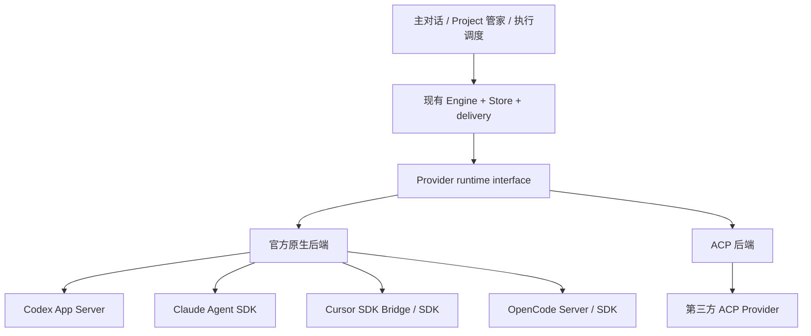

# Spec: 官方原生连接器与 ACP 扩展

## Design

将 ACP 从 Engine 的统一内部协议降为一种连接器实现。Engine 保持现有会话、执行、审批、投递和持久事实，通过一个 Provider-neutral 的运行接口调用原生或 ACP 后端。四家主流 Provider 的新会话优先使用官方原生入口，第三方继续用 ACP。具体边界已获用户确认；本轮候选实现尚未验收，当前未有原生连接器切换生效。

### 官方入口（2026-10-06）

| Provider | 建议接入 | 已核对的官方入口 | 实施前必须核对 |
| --- | --- | --- | --- |
| Codex | Rust 直接驱动本地 codex app-server，优先稳定 stdio JSON-RPC | [App Server](https://developers.openai.com/codex/app-server)：thread/turn、事件、steer/interrupt、审批 | 安装版本 schema、initialize/capabilities、停止实际终态、模型/权限/MCP映射 |
| Claude Code | 官方 Claude Agent SDK，受监督薄 JS sidecar，不重造 agent loop | [Agent SDK](https://code.claude.com/docs/en/agent-sdk/overview)：TypeScript/Python、工具、会话、权限、MCP | SDK runtime/版本、流式输入/interrupt/resume 与 tool permission callback；认证不默认复用 claude.ai 登录 |
| Cursor | 官方 TypeScript SDK 薄 sidecar；固定版本Bridge未暴露steer，采用设计已允许的SDK路径 | [SDK](https://cursor.com/docs/sdk/typescript)、[Bridge](https://cursor.com/docs/sdk/bridge)：Agent/Run、官方 sdk.v1 Connect/protobuf | 精确 model 参数、300K/effort能力、批准/拒绝回调、实时 steering/停止终态、key/本地 store 与打包 |
| OpenCode | 官方本地 Server API/事件，或官方 SDK 薄客户端 | [Server](https://opencode.ai/docs/server/)、[SDK](https://opencode.ai/docs/sdk/) | installed API/schema、认证、session/abort、事件缺口/断线恢复、权限与 question 回答 |
| OpenCode2 | 保留独立 Provider 身份，按官方 V2 SDK/Client 单独实现 | [V2 SDK](https://opencode.ai/v2/docs/build/sdk) | 不与 V1 SDK 的 /v2 API 命名混用；V2 SDK为嵌入host，不能假定使用V1 HTTP server；控制/审批逐项核对 |

“官方接口”不等于支持全部 CodeTwo 能力。能力目录明确区分支持、不支持、待验证；不支持 steering 时保持记账/下一轮采用，不虚假确认。取消 HTTP/SSE 请求或 AbortSignal 不等于停止后端 agent。

真实调研见 [官方研究结果](evidence/research-result.json) 与 [Engine seam](evidence/seam-result.json)。npm registry观察到的版本不是本机已安装或运行验收版本；实施须锁定包/CLI与schema，不仅写latest。固定@cursor/sdk 1.0.36源码探针发现：complete_delivered是肯定回执，不得再发；revert_to_followup同时用于15秒确认超时和提交异常，因此本身不能证明未送达。该结果、断线或没有结果均先记unknown并核对原run/conversation；仅取得明确未送达的原尝试证据后，才可经原唯一delivery在原run结束后补充，不跟随官方示例笼统重发。Claude streamInput、OpenCode busy时prompt不能无探针宣称等价steering。

官方文档要求核对认证边界：Claude SDK 不默认允许第三方提供 claude.ai 登录/套餐限额；Cursor SDK 有 API key 与独立 SDK 使用记录。沿用已获授权的账户/凭据方法，不自动注册、浏览器登录、签 key 或增加付费。无可用合规凭据时可以完成 codec/fixture，但真实会话验收明确阻塞。委派 Full Access 不修改产品会话权限。

T3/Herdr 只用于结构对照，不以它们支持某 Provider 证明本连接器通过。T3调研固定提交为64275ae39653379e63f49f87be021c190fd20e81，查看ProviderAdapter、四native adapter和第三方ACP adapter；具体路径/局限在研究结果。[Herdr](https://herdr.dev/docs/agents/) 已由主Agent自行搜索确定官方herdrdev/herdr及资料，借鉴终端owner、idle/working/blocked聚合与恢复；[官方integration](https://herdr.dev/docs/integrations/)的hooks/socket状态不等于逐工具审批或SDK执行回执。未安装integration或写用户配置。

Cursor SDK文档未确立完整交互审批答复通道。以目录/版本探针为准：若只能hooks门控、无法实现approval-required暂停/答复，则明确该模式不可用，不能自动改full-access或切ACP。协调角色须可可靠禁止写入工具才可运行；SDK request事件本身不证明可回复。官方Bridge与SDK最终只选一个经过相同合同验收的路径。本轮探针与主Agent独立复跑见 [能力报告](../../../../script/provider-sidecars/capability-probes/report.md)；39项匹配只证明固定官方证据，真实审批/工具禁止/steering/停止仍待生产路径验收。

### 一套内部接口，两种后端

接口只覆盖 Engine 真正消费的操作：能力/配置发现、创建、恢复、发送一轮、运行中补充（若支持）、停止/核对、权限/问题回应、事件流、dispose。身份使用原 C2 session/turn/attempt ID，同时保存 backend kind、backend contract version、原生 session/run ID 与 workspace。不得让原生 ID替代 C2身份。

事件映射到既有文字/思考/工具/问题/权限/usage/终态等 domain 事件，保留原生事件引用与必要诊断，但不将完整 SDK 对象扩散进 UI/Store。未知事件必须可诊断且有大小限制，不能被当作完成。

send_turn 的 Accepted（native turn/run ID）与 TurnTerminal（completed/cancelled/failed/unknown）分离。resume能力区分原生Resume、Load、需用户确认的历史续接与不支持；stop能力区分仅请求响应与可核对terminal，避免笼统boolean。ACP的SessionUpdate→RuntimeEvent在ACP adapter内，RuntimeEvent→现有Event及PermissionPolicy仍由Engine处理。BunToolBroker与前端中残留ACP命名也要逐一检查，不只替换client字段。

每后端有明确能力集合：resume、live steering、stop acknowledgement、工具审批、MCP、自定义工具、history、token usage、文件/图片、model options。Host 按实际目录校验配置，选项不能转换成近似模型或把不支持返回成功。Approval/question 是悬挂输入，不能被归一化为失败/完成。

### 边界与实现方式

- Provider-neutral 类型属于 Core，不能直接公开 ACP wire DTO。ACP client 放在 ACP backend 内；native backend 不依赖 ACP 类型。
- Rust 直接消费 Codex stdio 与 OpenCode HTTP/Event API，少加运行层。Claude SDK 的 JS sidecar 是 SDK调用/事件翻译/审批桥，不持有第二份任务或控制状态。Cursor固定官方SDK的类型/proto/源码探针已证明Bridge缺少steer，因此选TypeScript SDK sidecar这一条路径；不同时维护Bridge fallback。该选择不是带凭据的运行兼容通过。
- 自有 sidecar 的 C2 私有 IPC 有版本、关联请求、会话绑定、帧大小限制和异步控制通道；只翻译 SDK，不能成为另一 Engine/Memory/调度器。SDK 原生 store 属于 Provider context，只保留到原生身份引用，不冒充 C2 canonical transcript。持久SDK store放入明确C2会话所属目录，provider checkpoint按用户数据保留；不把用户现有store当测试scratch删除。
- 使用已有 host Tool Broker、session 工具权限和 Memory 注入回执；SDK 工具回调/MCP 转接必须校验本 session权限，不把 child Full Access 或 Provider 默认 auto-approve 传成全局授权。
- process/连接有明确 owner、寿命、退出/失联处理；Core 关闭不残留所属 sidecar/server。对已有用户启动的 server 只连接、不关闭它。
- 保留原 NAPI/Server/UI domain contract，只有公开能力诊断确需变化才调整消费者并实际渲染。Project agent不感知后端协议。

### 异步、权限和唯一投递

创建/发送/steer/停止先按现有持久 attempt 领取；网络/SDK等待不在全局 document/delivery gate 中。发送的接受回执、流事件、后端终态、采用回执分别保存。不能因流断线推断任务停止。

停止直达后端控制，越过其他慢任务。原生 stop/abort 返回只证明该官方方法响应，是否释放写入者仍以匹配 session/run 终态或明确核对证明。旧写入者未确认释放不得派替代。

后端 approval request关联 C2 session、run、request、权限范围和时效；用户回复只落原请求一次；断线/过期/跨会话不能被当新批准。SDK的默认auto-approve不能代替用户选择的runtime权限：approval-required须回调宿主，已明确选择full-access的执行会话仍只在其既有授权范围运行；协调角色不因此获得文件写入/任意命令能力。不能无条件复刻quickstart或把本次Cursor委派模式套给产品全部会话。

创建/发送前后崩溃、未知结果与重连仍用原持久尝试/command receipt恢复，不盲发；native事件重复/乱序/缺口须去重或显式缺口状态。不能把断线恢复改成第二发送路径。

### 旧会话与替换

新增会话固定选择 backend 并持久化版本；不以当前 Provider registry 推断旧会话使用协议。已知ACP创建的旧记录标记legacy ACP；导入来源或协议无法证明的记录为legacy-unclassified，等待核对。已有session_import把原生ID放进acp_session_id的路径必须单独迁移，不能仅靠字段名推断。保留原session/attempt/回执，不直接向AppServer/SDK用旧ID resume。

当前活跃 ACP writer原样排空，禁止同时开 native writer。闲置会话可在用户确认后：若官方验证同一原生上下文兼容则可真实恢复；否则用版本化 C2中性历史建立明确的新 native session，并展示“迁移续接”，不声称原生上下文完整恢复。unknown/审批悬挂会话先核对，不自动迁移。

四后端通过完整验收后去除各 builtin 的新会话 ACP启动/包装路径。第三方 ACP不删除。旧会话兼容只保留其实际还引用的有版本路径，有负责人与清理触发（所有 legacy writer/未决 attempts排空且迁移核验完成）；不能留下永久静默 fallback。native失效明确显示原因，不自动切 ACP、另一个模型或账户。

## Acceptance criteria

- [ ] AC-1: Engine/domain interface不暴露ACP DTO；第三方ACPfixture仍可初始化、发送、审批、取消、恢复与结束。
- [ ] AC-2: Codex官方App Server fixture及实际安装版本初始化/创建/恢复/stream/steer/停止/审批/MCP/usage通过，明确未测账户能力。
- [ ] AC-3: Claude官方SDK sidecar fixture的会话/stream/interrupt/permission/MCP与dispose通过；合法认证下实际兼容验收另记录。
- [ ] AC-4: Cursor官方Bridge或SDK唯一选定路径的目录/options、Agent/Run、resume/stream/control、审批/tool隔离与cleanup通过，不虚报steering/300K。
- [ ] AC-5: OpenCode V1/V2独立版本/fixture与实际Server创建/恢复/事件/abort/permission/question通过，不混用API。
- [ ] AC-6: 慢A创建/网络/steering不阻挡B接收投递与回执；停止及时进控制；same-session单writer，全局锁不跨网络。
- [ ] AC-7: 四后端领取/发送/回执前后故障、重复/乱序/断线/缺口、审批过期/跨session与unknown无盲重发/权限扩大。
- [ ] AC-8: 旧ACP会话迁移/回滚保留历史和attempt；不把ACP ID当native ID；活动writer不双开；native失效不静默fallback。
- [ ] AC-9: 原幕僚异步/容量释放/Memory/事件限制和适用Core/桌面检查通过；实际UI能力/审批/取消状态正确渲染。
- [ ] AC-10: 独立验收覆盖具体源码/SDK/CLI版本和清理；真实付费/凭据、所有OS打包、外部账号/云运行与CI分别说明；无发布。

## Human design decision

2026-10-06，用户在两份具体Spec与下一步实施停点展示后明确回复“开始实行并调研。要求直接让 Cursor Sonnet 300K full access 执行。”本记录据此登记具体设计确认，确认者为当前人类请求者，与实现owner不同；保留此前AI复核未取得verdict的事实，不改称复核通过。正式实施仍须逐项运行验收。
